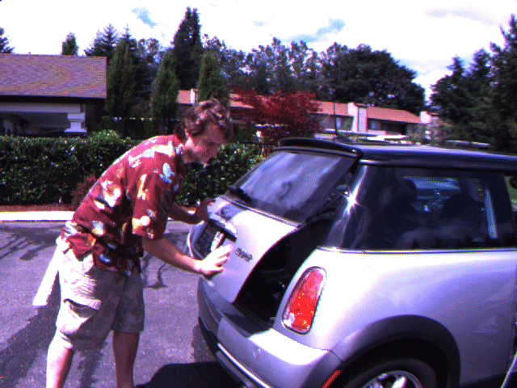

<h2 align="center">HWFI: Hybrid Warping Fusion for Video Frame Interpolation</h2>
**<p align="center">[Paper](https://link.springer.com) |	[ArXiv](https://arxiv.org) | [Project page](http://yu-li.github.io)</p>**
**<p align="center">[Ye Zhu](https://yu-li.github.io/), [Yu Li](https://yu-li.github.io/), [Ruoteng Li](https://liruoteng.github.io/), [Xintao Wang](https://xinntao.github.io/), [Yue Luo](https://github.com/lawy623), [Ying Shan](https://scholar.google.com/citations?user=4oXBp9UAAAAJ&hl=en)</p>**




**<p align="center">HWFI is a method for video frame interpolation. It can synthesize intermediate frame at any time between two video frames</p>**

**<p align="center">HWFI 是一个通用视频插帧方法。可以预测两帧中间任意时刻的中间帧。</p>**


## Usage

### Installation

Download the codes and pre-trained model in `weights` folder. Then install the required packages:
- pytorch==1.2.0
- cupy==7.3.0
- kornia==0.1.4
- torchvision
- opencv-python
- tqdm
- scikit-image
- imageio
- PIL

### Run

**Video Frame Interpolation**

You can use your own video to process. 
```
$ python slomo.py --model BWIN --gpu_ids 0 --resume weights/BWIN.pt.tar --sf 2 --video video_path --dataset VideoTest --extract_dir tmp_extract_video --folder_name 2X --output ./output_video 
```
(generate 2X video)
```
$  python slomo.py --model BWIN --gpu_ids 0 --resume weights/BWIN.pt.tar --sf 4 --video video_path --dataset VideoTest --extract_dir tmp_extract_video --folder_name x4 --output ./output_video 
```
(for 4X interpolation)

**Image Interpolation**

```
$ python test.py --model BWIN --gpu_ids 0 --resume weights/BWIN.pt.tar
```
This is an image interpolation example, input frames are in the folder `examples`.

## Evaluation

**Vimeo90K**: Download [Vimeo90K dataset](http://toflow.csail.mit.edu/) at `./vimeo_triple`

**MiddleBury**: Download [MiddleBury OTHER dataset](https://vision.middlebury.edu/flow/data/) at `./middlebury/other-data` and `./middlebury/other-gt-interp`

**UCF101**: Download [UCF101 test dataset](https://liuziwei7.github.io/projects/VoxelFlow) at `./ucf101`

```
$ python eval.py --model BWIN --dataset VIMEO --val_file vimeo_triple/ --gpu_ids 0 --resume weights/BWIN.pt.tar --name vimeo
$ python eval.py --model BWIN --dataset Middlebury --val_file middlebury/ --gpu_ids 0 --resume weights/BWIN.pt.tar --name middlebury
$ python eval.py --model BWIN --dataset UCF101 --val_file ucf101/ --gpu_ids 0 --resume weights/BWIN.pt.tar --name ucf
```

## Training

**Vimeo90K**: Download [Vimeo90K dataset](http://toflow.csail.mit.edu/) at `./vimeo_triple`

```
$ python train.py --model BWIN --dataset VIMEO --batch_size 8 --gpu_ids 0 --train_file vimeo_triplet/ --val_file vimeo_triple/ --name exp0 --epoch 100 --optimizer Adamax --lr 0.001 --lr_scheduler MultiStepLR --lr_milestones 40 80 
```

We also support multi-gpus training, such as 4 gpus:

```
$ python -m torch.distributed.launch --nproc_per_node=4 train.py --model BWIN --dataset VIMEO --batch_size 8 --gpu_ids 0 1 2 3 --train_file vimeo_triplet/ --val_file vimeo_triple/ --name exp0 --epoch 100 --optimizer Adamax --lr 0.001 --lr_scheduler MultiStepLR --lr_milestones 40 80 
```
## Reference
Optical Flow:
[pytorch-PWCNet](https://github.com/sniklaus/pytorch-pwc)

Video Interpolation:
[DAIN](https://github.com/baowenbo/DAIN)  [SoftSplat](https://github.com/sniklaus/softmax-splatting)  
